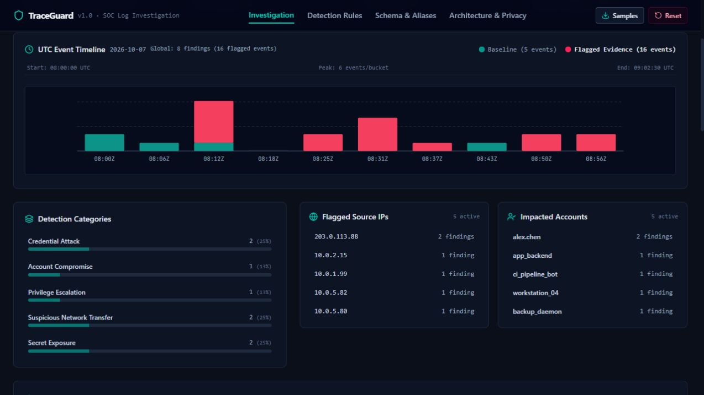
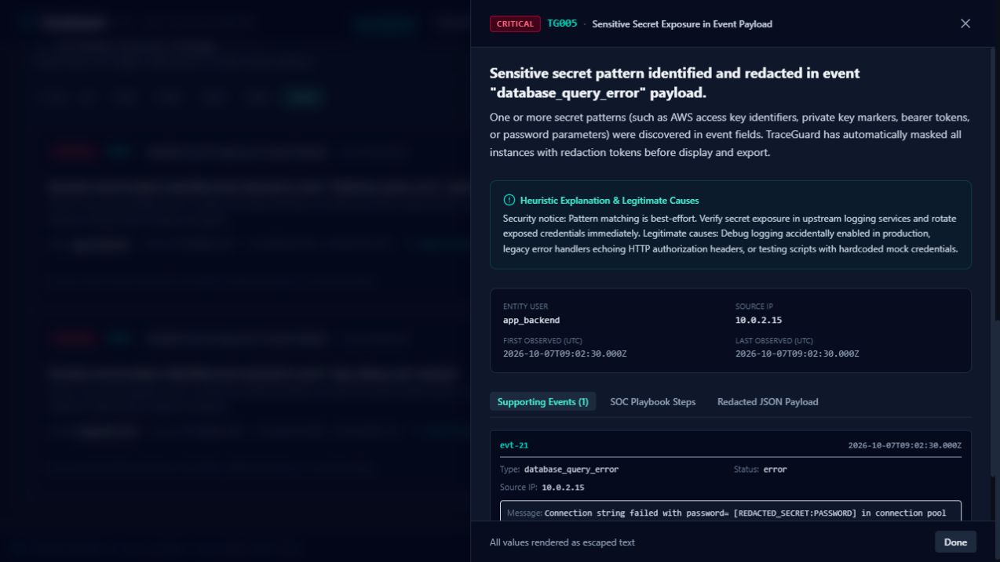

# TraceGuard

A browser-based cybersecurity portfolio tool for investigating structured security logs. Five explainable rules correlate authentication failures, suspicious login success, privileged role changes, network egress, and possible exposed secrets.

**Built by [onkar-cybersec](https://github.com/onkar-cybersec)** with AI assistance, then reviewed and tested before release. It complements [AgentTripwire](https://github.com/onkar-cybersec/AgentTripwire).

## Screenshots

Real captures from the running application using the included synthetic demo.





## Features

- JSON arrays, `{ "events": [...] }`, and quoted CSV input.
- **2 MiB / 20,000 events** limits; rejected-row explanations alongside valid-row analysis.
- UTC timeline, category and severity breakdowns, affected users/sources, search, filters.
- Findings linked to evidence IDs, timestamps, explanations, and investigation steps.
- Best-effort secret masking before display/export; redacted JSON and self-contained HTML reports.
- Trigger and benign demos; reset clears application state.

## Run locally

Use Node.js 24 or later and pnpm 11 or later.

```sh
git clone https://github.com/onkar-cybersec/TraceGuard.git
cd TraceGuard
pnpm install --frozen-lockfile
pnpm dev
```

Open the local URL printed by Vite. No account, API key, or environment file is needed.

```sh
pnpm test       # engine regressions
pnpm lint       # TypeScript check
pnpm build      # production assets
pnpm preview    # preview the production build
```

## Five detection rules

| ID | Signal | Threshold | Review context |
| --- | --- | --- | --- |
| TG001 | Authentication failure burst | 5+ failures for the same source IP and user within 5 minutes | Password mistakes or broken clients may explain it. |
| TG002 | Login success after failures | Success after 5+ failures for the same source IP and user within 10 minutes | Investigate possible compromised credentials; legitimate retries are possible. |
| TG003 | Privileged role assignment | Explicit role change to admin, administrator, root, or superuser | Check authorized change records. |
| TG004 | Network egress indicator | 10+ MiB to a public destination IP, or destination port 4444/1337 | Backups and lab services may trigger it; this does not prove exfiltration. |
| TG005 | Potential secret exposure | Recognized private-key, access-key, bearer-token, or password patterns | Review upstream logging and genuinely exposed credentials. |

The IP classifier excludes configured private, loopback, link-local, multicast, and documentation IPv4/IPv6 ranges. Its static range list is a heuristic, not an authoritative live routing database.

## Input schema

Required: `event_type` and `timestamp` (ISO 8601 with explicit timezone).

Optional: `user`, `source_ip`, `destination_ip`, `destination_port`, `bytes`, `status`, `new_role`, `message`. Ports are integers from 1 to 65535; byte counts are nonnegative safe integers. Additional fields are retained as sanitized evidence. Supported aliases appear in **Schema & Aliases** and `src/engine/parser.ts`.

```json
{"events":[{"event_type":"user_login","timestamp":"2026-10-07T08:15:10Z","user":"demo_user","source_ip":"198.51.100.45","status":"failure","message":"Synthetic failed login"}]}
```

```csv
event_type,timestamp,user,source_ip,status,message
user_login,2026-10-07T08:15:10Z,demo_user,198.51.100.45,failure,"Synthetic message, with a comma"
```

Downloadable trigger/benign samples are available in both formats. All examples are synthetic; their illustrative IPs are never contacted.

## Walkthrough

1. Launch the trigger demo: 21 valid events and 8 findings spanning all five rules.
2. Select TG005: 2 findings with matching counts, entities, categories, and timeline evidence.
3. Inspect evidence and the SOC playbook.
4. Download JSON or HTML and review locally.
5. Reset and launch the benign baseline: 7 valid events and no findings.

## Privacy and limitations

Log parsing and detection run in the browser. The source contains no log-upload endpoint, telemetry, runtime model calls, or persistent log store. The host receives ordinary page requests; the AI Studio version may load hosted font assets. For sensitive data, review the source and run a trusted local copy. Secret redaction is best-effort and **does not anonymize user names or IP addresses**.

Reset releases application-state references; it cannot guarantee forensic erasure of browser memory or downloaded files. Reports may retain confidential operational context: keep them private.

This educational prototype is not a production SIEM, live scanner, or complete intrusion detector. No findings does not prove a system secure. Coverage depends on supplied event types/fields; false positives and false negatives are expected. Validate findings against original records and business context.

## Structure

- `src/engine/`: validation, IP utilities, redaction, correlation, reports.
- `src/components/`: dashboard, evidence, schema, samples, rules.
- `src/data/`: synthetic datasets.
- `tests/`: engine/regression tests.
- `docs/screenshots/`: real browser captures.

## License

MIT. See [LICENSE](LICENSE).

## Release validation

50 automated tests passed, TypeScript checking passed, and the production build passed. The trigger demo and benign baseline were also checked in the browser.
